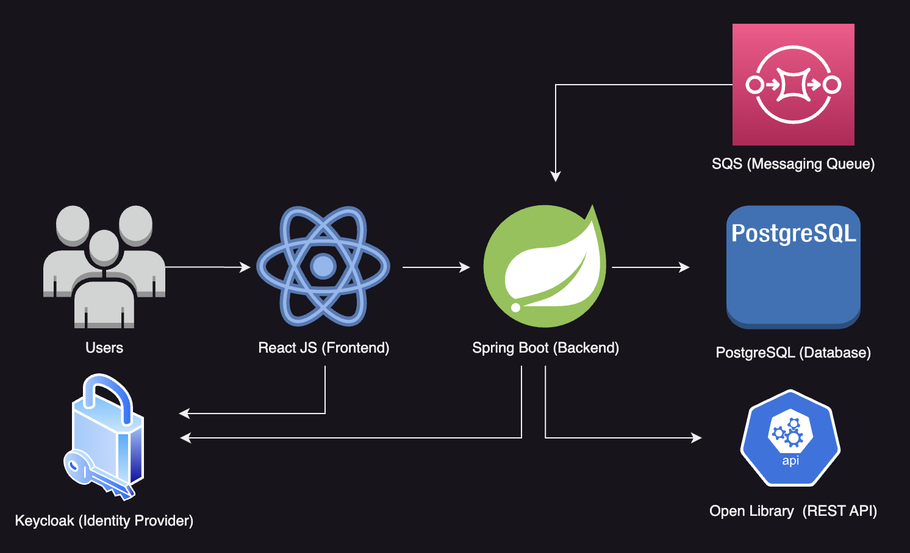

# Fullstack Book Review App

## Introduction
Developed a Fully Tested book review application where users can add new books and write or see reviews posted by 
different users. The aim of the project is to master testing techniques for effectively carrying out unit,
integration, and end-to-end testing following a test driven (TDD) approach.

## Application Architecture
- Keycloack (Open source identity and access management solution) to secure parts of the frontend and backend.
- PostgreSQL (RDBMS) to store data in a relational database.
- Amazon SQS (Simple Queuing Service) for asynchronous message processing.
- Spring Boot backend with Java
- Dependency on a remote REST API for fetching book information.
- Single page application frontend with React and Typescript

    

## Running the Project Locally
1. Make sure Docker is running
2. Start required infrastructure to run application with`docker-compose up`
3. Build the project `./gradlew build`
4. Run the application with `./gradlew bootRun`
5. Access http://localhost:8080 for the application frontend
6. (Optional) access http://localhost:8888 for the Keycloak interface

Default Application Users
* duke (password `dukeduke`)
* mike (password `mikemike`)